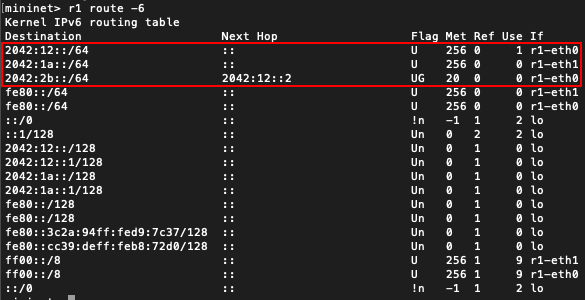
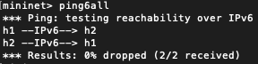
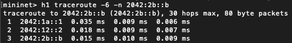
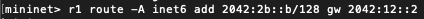

# HOW TO: document to help students

The goal of this document is to help students using the examples about static routing and the STP protocol. Through it, the student will learn the important commands to be able to work with the given networks to understand further these concepts of the course.

## Static routing

In a few words, static routing allows you to chose the routes that the routers must follow to transmit paquets to a specify destination. It can be benefic for the network manager: he can force the routers to chose a specified path, for example due to performance reasons, or give some back-up links in case of failure. Unfortunately, as you will see with these few examples, it can give desastrous paths if it is badly initialized. In this document, and through the examples, we will excusively use the IPv6 addresses.

### Usefull commands

The examples listed below are taken from `static_routing`.

* `rX route -6`, where `rX` is the router `X` (use the name given in the python file), shows the routing table of the router (in IPv6). Most of them are not of our interest, but some of them will be usefull to understand the working of the network.
  
  

  From the example above, we can see the routes of our interest for the router `r1`. From static routing, we have advertised three routes for this router. The two first destinations are neighbours of router `r1`, so there is no nextHop towards this destination. On the contrary, to reach `2042:2b::/64`, the router must send the packet to `2042:12::2` because there is no direct path toward this destination.
* `ping6all` makes a ping test for each pair of hosts.

  

  In this simple example, we can see that all the hosts from the network (`h1`and `h2` here) are connected and can exchange packets. It is an interesting tool to debug the next exercices, but it is not sufficient to check if the packets take the good path to reach their destination.
* `r/hX ping6 r/hY` makes a ping test from the router/host `X` to the router/host `Y`.
* `r/hX traceroute -6 -n r/hY` makes a traceroute in IPv6, from the router/host `X` to the router/host `Y`. This command is really important to let you see the paths used by the routers in these examples.

  

  The traceroute command allows us to see the path taken to reach the destination. In this very simple example, we see the path `h1->r1->r2->h2`, which is pretty basic, but in the next exercices, the routes will be more complex and less intuitive.

* `rX route -A inet6 add <addr prefix>/<prefix length> gw <gateway>`.
  
  

  Here is an example of use of this command. Even if in this exercice, it is a bit useless because all the routes are already advertised, but it will be important to correct the routing tables in case of failure.

### Exercices

#### Static routing network

This very first exercice is used to show and manipulate the usefull commands listed above.

#### Static routing network 2, 3 and 4

More complex exercices, using non-direct paths to reach destination. These exercices show that static routing can give some strange routing tables, leading to strange paths.

#### Static routing failure

In this last example, you will see that the current network can't exchange packets perfectly: some pairs of hosts can't communicate du to badly initialized routing table. The goal of this exercice is to change **ONLY ONE** routing table (but potentially many routes from this routing table) to make the network communicating. To do so, you must add correct routes, using the last command listed above. Don't forget that the routes with the longest prefix are chosen first.
