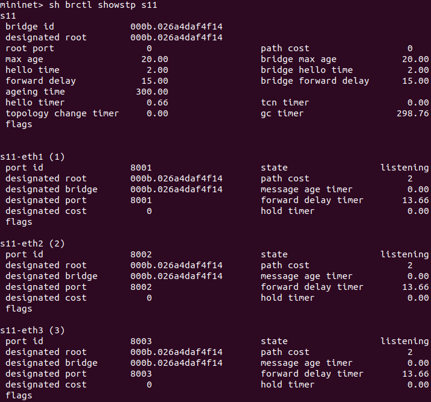
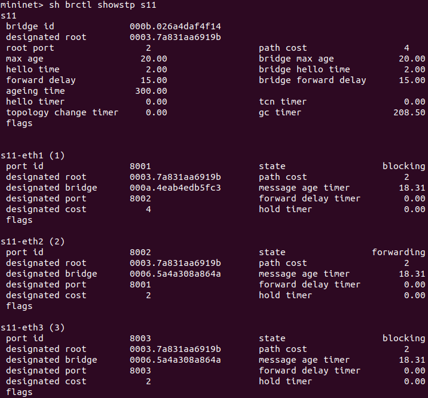

# HOW TO: document to help students

The goal of this document is to help students using the examples about static routing and the STP protocol. Through it, the student will learn the important commands to be able to work with the given networks to understand further these concepts of the course.

## Static routing

In a few words, static routing allows you to chose the routes that the routers must follow to transmit paquets to a specify destination. It can be benefic for the network manager: he can force the routers to chose a specified path, for example due to performance reasons, or give some back-up links in case of failure. Unfortunately, as you will see with these few examples, it can give desastrous paths if it is badly initialized. In this document, and through the examples, we will excusively use the IPv6 addresses.

### Usefull commands

The examples listed below are taken from `static_routing`.

* `rX route -6`, where `rX` is the router `X` (use the name given in the python file), shows the routing table of the router (in IPv6). Most of them are not of our interest, but some of them will be usefull to understand the working of the network.
  
  

  From the example above, we can see the routes of our interest for the router `r1`. From static routing, we have advertised three routes for this router. The two first destinations are neighbours of router `r1`, so there is no nextHop towards this destination. On the contrary, to reach `2042:2b::/64`, the router must send the packet to `2042:12::2` because there is no direct path toward this destination.
* `ping6all` makes a ping test for each pair of hosts.

  

  In this simple example, we can see that all the hosts from the network (`h1`and `h2` here) are connected and can exchange packets. It is an interesting tool to debug the next exercices, but it is not sufficient to check if the packets take the good path to reach their destination.
* `r/hX ping6 r/hY` makes a ping test from the router/host `X` to the router/host `Y`.
* `r/hX traceroute -6 -n r/hY` makes a traceroute in IPv6, from the router/host `X` to the router/host `Y`. This command is really important to let you see the paths used by the routers in these examples.

  

  The traceroute command allows us to see the path taken to reach the destination. In this very simple example, we see the path `h1->r1->r2->h2`, which is pretty basic, but in the next exercices, the routes will be more complex and less intuitive.

* `rX route -A inet6 add <addr prefix>/<prefix length> gw <gateway>`.
  
  

  Here is an example of use of this command. Even if in this exercice, it is a bit useless because all the routes are already advertised, but it will be important to correct the routing tables in case of failure.

### Exercices

#### Static routing network

This very first exercice is used to show and manipulate the usefull commands listed above.

#### Static routing network 2, 3 and 4

More complex exercices, using non-direct paths to reach destination. These exercices show that static routing can give some strange routing tables, leading to strange paths.

#### Static routing failure

In this last example, you will see that the current network can't exchange packets perfectly: some pairs of hosts can't communicate du to badly initialized routing table. The goal of this exercice is to change **ONLY ONE** routing table (but potentially many routes from this routing table) to make the network communicating. To do so, you must add correct routes, using the last command listed above. Don't forget that the routes with the longest prefix are chosen first.

## Spanning Tree - Local Area Network

*Most of the exercise are taken from the exercise session Local Area Networks: The Spanning Tree Protocol and Virtual LANs. You should do the exercise session first and then compare your results with the one given by the simulations done here.*

The spanning tree is computed using  `brctl`. The main differences between this and what you may have seen in the course are:

* The default cost is set to 2 instead of 1

* The root port is written in forwarding state instead of root state

### Usefull commands

* `sudo python3 -m ipmininet.examples --topo=[topology]` launches the CLI. `[topology]` is the name of an exercice, for example `spanning_tree_hub`

* `sh brctl showstp [switch]` gives the information of the spanning tree at switch `[switch]` (i.e. `s1`, `s2`, ...). The spanning tree needs some time to be fully computed. In the few early seconds you should get something like this

    

    Here, the output of the command is composed of 4 blocs that can be separated in 2 parts:
    1. The first one gives some information about the switch itself. The most important part for us is its own id (`bridge id`) and the id of the root of the whole spanning tree (`designated root`). The number are written in hexadecimal format.
    2. The 2, 3 and 4 ones gives informations about the ports. For example, `s11-eth1` describe port 1 of switch s11. The `state` part is currently `listening`, which means that the spanning tree is being computed. This state will change in next few seconds

    When the spanning tree is computed, it gives:

    

    Here, 2 ports are blocked (`state blocking`) and 1 is forwarding data (`state forwarding`), the root. You can also see that the root of the whole network is the switch s3 (`designated root 0003.7a `). With `brctl`, you cannot know which port is the root of the switch. The root port of a switch will be in the forwarding state, because it sends frame over this port.

* `sh brctl delif [switch1] [port1]` and `sh brctl delif [switch2] [port2]` allows you to delete a link between 2 switches. For exemple, to delete the link between the port 3 of s1 and the port 4 of s2, you need to use 
    ```
    sh brctl delif s1 s1-eth3
    sh brctl delif s2 s2-eth4
    ```

* `sh brctl setpathcost [switch] [port] [weight]` allows you to set the cost of a `port` to the value `weight`. `[switch]` and `[port]` are in the same format as before and `[weight]` is an integer number between 1 and 65535.
    Keep in mind that the weight is set on the port of the switch. If you want to adjust the weight of an entire link, you should adjust the weight of all port forming that link

* `exit` or `CTRL+D`: stops the CLI

### Exercises

1. To launch the network, open a terminal in directory `ipmininet` and type

    ```
    sudo python3 -m ipmininet.examples --topo=spanning_tree_hub
    ```
   
   Compare the state of each port with what you have found in exercise 1 of exercise session **Local Area Networks: The Spanning Tree Protocol and Virtual LANs**. Keep in mind that the root port are described as forwarding
 
2. Break the link between s3 and s12 in the previous exercise. The port X of switch Y is written as `sY-ethX`. When the link is destroyed, look at the topology of the new spanning tree

3. Open a terminal in the same directory (`ipmininet`) and type
    ```
    sudo python3 -m ipmininet.examples --topo=spanning_tree_intermediate
    ```
   
   Compare the spanning tree given by `brctl` with the you have found in exercise 3 of the exercise session. You can delete a link or adjust a weight and see how the spanning tree changes
   
4. Open a terminal in the same directory (`ipmininet`) and type
    ```
    sudo python3 -m ipmininet.examples --topo=spanning_tree_full_mesh
    ```
   
   Compute the spanning tree and compare your answer with the one given by `brctl`.
   
5. Open a terminal in the same directory (`ipmininet`) and type
    ```
    sudo python3 -m ipmininet.examples --topo=spanning_tree_adjust
    ```
   
   Here, the spanning tree is already given to you, it looks like this:
   
   
   
   Change the weight of only 2 links to get a spanning tree that looks like this:
   
   